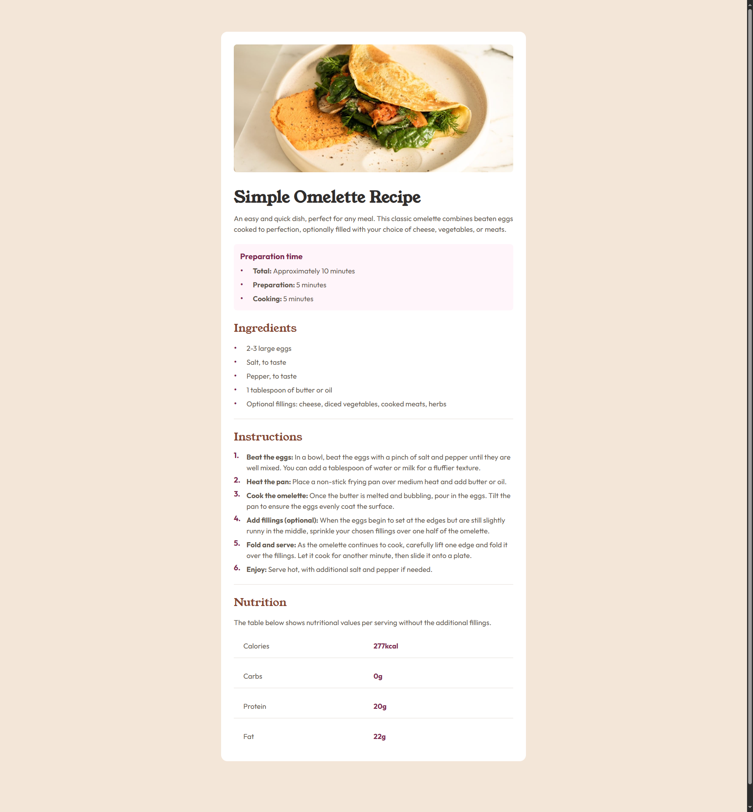

# Frontend Mentor - Recipe page solution

This is a solution to the [Recipe page challenge on Frontend Mentor](https://www.frontendmentor.io/challenges/recipe-page-KiTsR8QQKm). Frontend Mentor challenges help you improve your coding skills by building realistic projects.

## Table of contents

- [Overview](#overview)
  - [The challenge](#the-challenge)
  - [Screenshot](#screenshot)
  - [Links](#links)
- [My process](#my-process)
  - [Built with](#built-with)
  - [What I learned](#what-i-learned)
  - [Continued development](#continued-development)
- [Author](#author)

## Overview

### Screenshot



### Links

- Solution URL: [https://github.com/david-franca/recipe-page](https://github.com/david-franca/recipe-page)
- Live Site URL: [https://recipe-page-5jgy.vercel.app/](https://recipe-page-5jgy.vercel.app/)

## My process

### Built with

- Semantic HTML5 markup
- CSS custom properties
- Flexbox
- CSS Grid
- Mobile-first workflow

### What I learned

I learned how to use CSS selectors more effectively. I used the GRID system and I had to remove the border from the last two elements and for that I had to use the nth-last-child selector as follows.

```css
.parent {
  display: grid;
  grid-template-columns: repeat(2, 1fr);
  grid-template-rows: repeat(4, 1fr);
  grid-row-gap: 16px;

  & > div {
    border-bottom: 1px solid var(--stone-150);
  }

  & > div:nth-last-child(-n + 2) {
    border-bottom: none;
  }
}
```

### Continued development

I need to know more about CSS selectors and how to do styling in a more advanced way.

## Author

- Website - [David França](https://davidfranca.vercel.app/)
- Frontend Mentor - [@david-franca](https://www.frontendmentor.io/profile/david-franca)
